# School_District_Analysis

## Overview of School District Analysis
The purpose of this project was to aggregate student math and reading scores and analyze the data to uncover trends related to school spending, size, and type.  After an initial analysis, evidence of academic dishonesty among the ninth grade class at Thomas High School warrented a revised analysis, removing the affected scores and re-examining the data and trends.

## Results

### How is the district summary affected?
Removing THS's ninth grade scores lowered the scores for the district, as displayed below.

* Average Math Score went from 79.0 to 78.9
* Average Reading Score remained steady at 81.9
* % Passing Math went from 75% to 74.8%
* % Passing Reading went from 86% to 85.7%
* % Passing Overall went from 65% to 64.9%

#### District summary with THS 9th graders
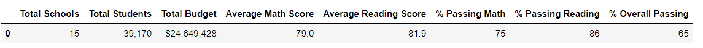

#### District summary without THS without THS 9th graders
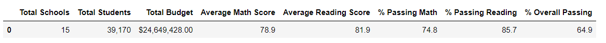

### How is the school summary affected?
Similarly, THS's statistics were also affected.  

#### School summary with THS 9th graders
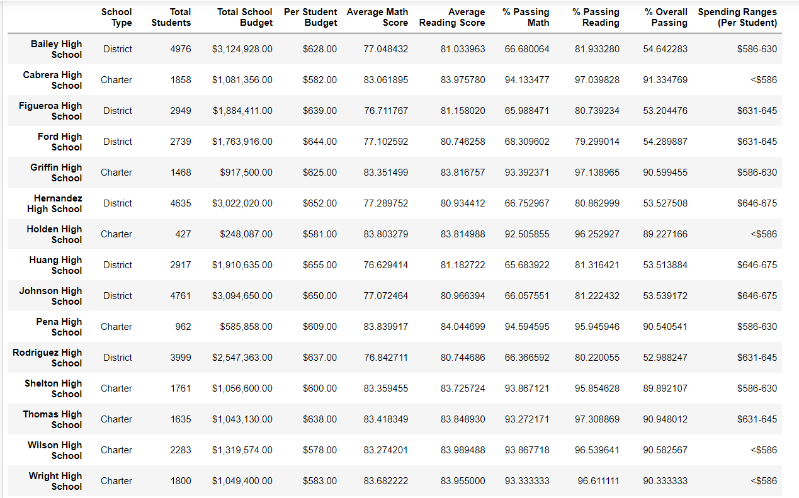

#### School summary without THS 9th graders
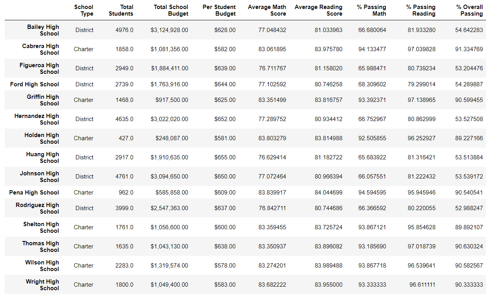

### School Rankings
THS's school standing with the 9th scores included was second.  After removing the questionable scores, THS's remained as the second ranking school.

### Math and Reading Scores by Grade
When grouped by school, math and reading scores accross grade levels were stable, with the notable exception of no longer having data for the 9th grade class at THS.

#### Math scores by grade
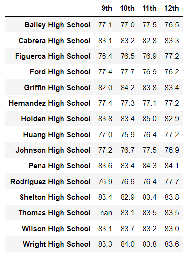

#### Rreading scores by grade

### Scores by School Spending

#### Scores by school spending with THS 9th grade data
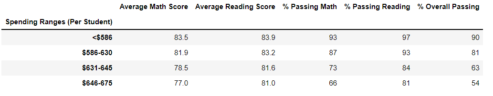

#### Scores by school spending without THS 9th grade data
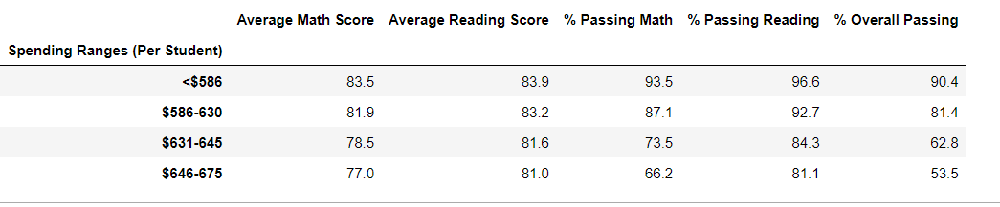

### Scores by School size

#### Scores by school size with THS 9th grade data
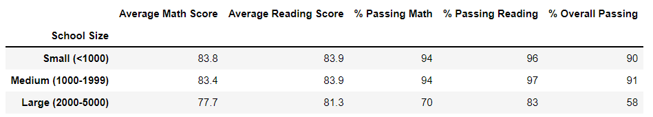

#### Scores by school size without THS 9th grade data
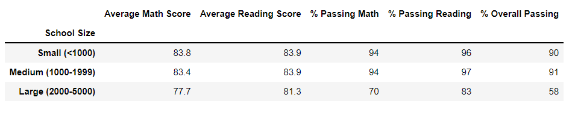

### Scores by School type

#### Scores by school type with THS 9th grade data
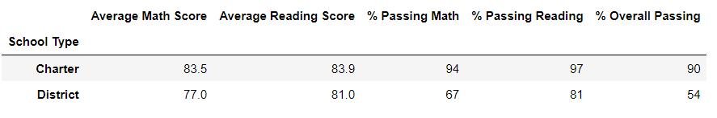

#### Scores by school type without THS 9th grade data
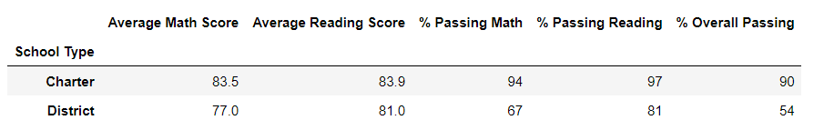

# Summary 
After removing the THS ninth grade scores, 4 key metrics at the district level were affected: Average Math Score, % Passing Math, % Passing Reading, and % Passing overall declined. 
